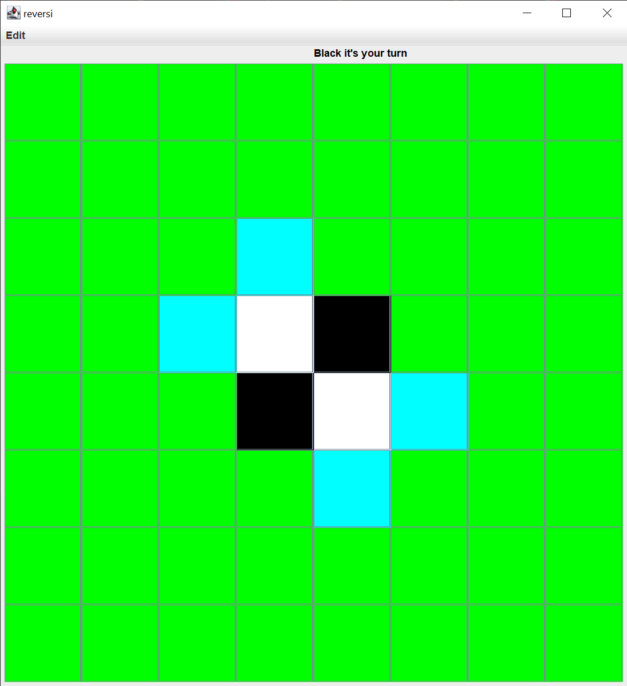

# reversi

Gebaut für den Software-Engineering Kurs im SS23

[Was ist reversi?](https://de.wikipedia.org/wiki/Othello_(Spiel))

# Merkmale

- Text und Grafische Spieloberfläche
- MVC Architektur
- Undo/Redo
- Eigenschaften vom Spiel sind in Komponente getrennt
- Spiele können in Dateien gespeichert und geladen werden
